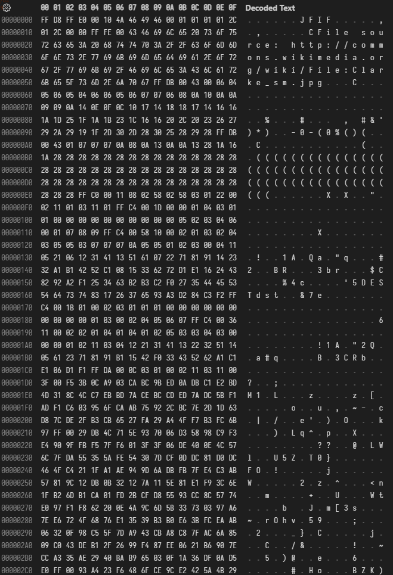

<!-- _class: lead -->

# **情報セキュリティ**

<!-- "魔法"のデザインとハックを考える -->

(c) 2022 liveasnotes

---

<!-- _backgroundImage: none -->

# Note:

この資料は情報科学を専門的に学んでいない方に向けて、１時間半で情報セキュリティとその基礎について概観してもらうために作成したものです。
技術的な詳細はかなり省いていますが、間違いがあれば必要に応じて修正していくので、随意ご指摘いただければ幸いです。

また、この資料はクリエイティブコモンズライセンス 表示 4.0 国際: https://creativecommons.org/licenses/by/4.0/ で公開しているので、内容については適切な著作権表記の下、自由に再利用できます。

---

<!-- _backgroundColor: #111 -->
<!-- _backgroundImage: none -->
<!-- _class: lead -->

<strong style="color: #ccc; text-shadow: 0 0 20px rgba(150, 150 ,255, 1);">隠されたプロセス</strong>

私たちを繋ぐもの

"彼ら" は見ている。

デザインとハック

---

# **隠されたプロセス**

コンピューターは、世界をどう見ているのか？
私たちがそれを触るとき、なにが起きているのか？

私たちに隠されたそのプロセスを、少しだけ覗いてみよう。

keywords:
2 進数，フォーマット，ファイルシステム，GUI，WYSIWYG

---

> Any sufficiently advanced technology is indistinguishable from magic.
> ー Arthur C. Clarke

十分に発達した科学は、
魔法と見分けがつかない。

<!-- https://commons.wikimedia.org/wiki/File:Clarke_sm.jpg -->
<!-- This work has been released into the public domain by its author, Mamyjomarash at the Wikipedia project. -->

---

**現代の魔法: コンピューター**

多くの人が仕組みを理解しないまま使っている。
それは理解しないまま使えるように工夫を重ねてきたから。

でも、トラブルを自力で解決したり、
新しい挑戦をするには、知識が必要。

---

## コンピューターは何をしているのか？

- データを読み込む（load/input）
- データを処理する（process）
- データを書き出す（write/output）

**Computer:「計算器」**
スマートフォンは、電気の力で動く
精緻なピタゴラ装置とも言える。

<!--正確に例えようとすると事前に共有すべき情報が増え過ぎてしまうので、この段階では「ピタゴラ装置」としている。-->

:thinking:「ピタゴラ装置？」

---

## 2 進数

そもそもコンピューターは電気の**高低**でデータを捉えている。
低いときは`0`、高いときは`1`として扱う。

この`0`と`1`を**ビット**と呼ぶ。
ビットをたくさん並べると、数値や文字など多彩な表現ができる。

Degitus：「指」
「デジタル」は整数のような離散値。
「アナログ」は小数のような連続値。

---

**論理ゲート**
入力に応じて、
出力を変える部品。

出力は`OR`，`AND`，`NOT`，`XOR` の組み合わせで表現できる。

たくさんの論理ゲートを組み合わせることで、複雑な処理を実現する。

<small style="font-size: .4em">image source: https://indirect2435.jimdofree.com/論理回路/</small>

<!--

---

cf.
https://www.google.com/search?q=論理回路&tbm=isch
https://www.google.com/search?q=IC&tbm=isch

-->

---

コンピューターは`0`と`1`の
羅列を見ている。

2 進数では`0`と`1`の２種類だけ。
⇒ 　すぐに繰り上がる。

`2`と`1/2`の倍数の組み合わせだけ。
⇒ 　小数点以下の表現に限界あり。
→ 　小数点を動かして計算する。

文字は ASCII や Unicode などの
ルールに沿って割り当てられる。
⇒ 　文字化けが起きることも…

| 2 進数   | 10 進数 |
| -------- | ------- |
| 0000     | 0       |
| **0001** | 1       |
| **0010** | 2       |
| 0011     | 3       |
| **0100** | 4       |
| 0101     | 5       |
| 0110     | 6       |
| 0111     | 7       |
| **1000** | 8       |

| 2 進数     | 10 進数 |
| ---------- | ------- |
| 0.0000     | 0       |
| **0.0001** | 0.0625  |
| **0.0010** | 0.125   |
| 0.0011     | 0.1875  |
| **0.0100** | 0.25    |
| 0.0101     | 0.3125  |
| 0.0110     | 0.375   |
| 0.0111     | 0.4375  |
| **0.1000** | 0.5     |

---

アプリにとっての読取・処理・出力

- 命令の読み取り

  - 人間向けコード（文字列）から機械語（`0`, `1`）へ

- 命令に合わせた処理

  - 論理回路を通じて計算処理

- 処理結果の出力

  - 計算結果（`0`, `1`）を人間が扱える情報に変換

---

## フォーマット

私たちが普段見ている「ファイル」は、ひとつのデータではない。
たくさんのデータをまとめたもの。

文字列「あいう」の正体は`11100011 10000001 10000010 11100011 10000001 10000100 11100011 10000001 10000110`のようなビット列。
変換ツール：バイナリ 変換 - バイナリ テキスト 変換 | Duplichecker https://www.duplichecker.com/ja/binary-translator

画像や動画も、
ビット列を一定のルール（フォーマット）に沿って並べたもの。

---

---

データのフォーマットは、ものによって異なる。
ファイル名の末尾に付ける**拡張子**は、フォーマットを示すもの。

拡張子だけを変えても、ファイルの中身は変わらない。
⇒ 　正しく読み取れなくなってしまう。

- 「Word / PDF で」
- 「MP3 / WAV で」

変換は各ソフトウェアの機能を使って行う。

<!-- jpg, jpeg, WAV, wav... 出力時の表記の違いが（歴史的な経緯で）内部的なフォーマットの違いと関わっていることもある。-->

---

## ファイルシステム

たくさんのファイルのデータを管理する仕組み。ファイルのデータは必ずしも連続して保存されているわけではない。データの削除はデータの住所を消しているだけ。
cf. デフラグ（image source: https://enjoy.sso.biglobe.ne.jp/archives/defragmentation/

**フォルダ**
「ファイル」はデータの入れ物（建物）
「フォルダ」はファイルの入れ物（住所）

---

## GUI: Graphical User Interface

コンピューターの内部では全て`0`と`1`の羅列で処理していても、
人間が扱いやすいように、グラフィックを使って表現する。

スマホをタップするとき：

GUI 上での操作（特定領域の押下）を検知して、
内部でのデータ処理（領域に応じた、読み書き、変換や計算）
が行われる。

---

## WYSIWYG:  What you see is what you get

データと GUI 上での表示はまったく別物。
データをそのまま編集するのは大変。

Lorem ipsum ...

`Lorem ipsum ...`

---

<!-- _class: lead -->

面倒なことは、システムに任せよう。

その積み重ねが "魔法" になっている。

---

<!-- _backgroundColor: #111 -->
<!-- _backgroundImage: none -->
<!-- _class: lead -->

隠されたプロセス

<strong style="color: #ccc; text-shadow: 0 0 20px rgba(150, 150 ,255, 1);">私たちを繋ぐもの</strong>

"彼ら" は見ている。

デザインとハック

---

# **私たちを繋ぐもの**

たくさんの端末が相互に接続し、情報を共有している。
しかも、それぞれが異なる方法で。

私たちはどうしてインターネットを使うことができるのだろうか？

keywords:
プロトコル，パケット，サーバー，DNS，検索エンジン

---

## インターネット

**LAN: Local Area Network**
施設内や端末間など狭い範囲のネットワーク。
最近は Wi-FI など無線 LAN の利用が増えている。

**WAN: Wide Area Network**
地域・国・世界規模のネットワーク。
電話回線も WAN の一種。

インターネット（the internet）は LAN や WAN などの全体。

---

## パケット

データは小さなパケットに分割してから送信される。
パケットは物理的な最短経路を選ぶわけではない。

隣の人に送ったメールも、
実は地球の裏側を通ってから届いているかもしれない。

---

## サーバーとクライアント

インターネットでは、
接続する側を「クライアント」、
接続される側を「サーバー」と呼ぶ。

**プロトコル**
通信のためのルール。通信を開始する段階で確認される。

---

## DNS: Domain Name System

IP アドレス（`142.251.42.163`など）は、人間には覚えにくい。
ドメイン名（`google.com`など）は覚えやすい。
この紐づけを行うのが DNS。

**ICANN**
IP を管理する組織。
IP アドレスは世界中にあるサーバーに割り当てられている。

---

## ブラウザ

サーバーからダウンロードしたデータを表示するソフトウェア。
データの内容に応じて、適切な表示方法を選択する。
e.g.
Chrome, Firefox, Safari, Edge, Internet Explorer, Opera...

**HTML, CSS, JavaScript**
Web ページを記述するための主要な言語。
HTML は文書の構造、CSS は見た目、JavaScript は動きを記述する。

---

## 検索エンジン

どこにどんなサイトやページがあるかをデータベースに整理し、
検索クエリに応じて結果を返す。
google.com/ や yahoo.co.jp/ は、その窓口みたいなもの。

**ダークウェブ**
主要な検索エンジンにインデックスされていないサイト群。ごく普通の日用品を売っていることもあるが、各サイト・ページのコンテンツが安全かどうかを見極めるのは難しい。かといって「検索エンジンに載っている = 安全」ではないので注意。

---

<!-- _class: lead -->

あえてたくさんの層・領域に分けることで
私たちはより柔軟に、より多くのことができるようになった。

---

<!-- _backgroundColor: #111 -->
<!-- _backgroundImage: none -->
<!-- _class: lead -->

隠されたプロセス

私たちを繋ぐもの

<strong style="color: #ccc; text-shadow: 0 0 20px rgba(150, 150 ,255, 1);">"彼ら" は見ている。</strong>

デザインとハック

---

# **"彼ら" は見ている**

大抵、通信そのものはオープンになっている。
つまり攻撃者は、通信の中身を見ることができる。

では、どうやって私たちのプライバシーや安全は守られているのか。

keywords:
暗号化，認証，ソーシャルエンジニアリング，トラッキング

---

## シーザー暗号，エニグマ

暗号化の目的：中身を秘密にしたまま情報を送る。

シーザー暗号は、文字をずらして暗号化する。古代ローマのカエサル（Caesar）も使った古典的手法。

エニグマは第二次世界大戦中にドイツが使った暗号機。シーザー暗号よりも複雑な仕組みで、文字の置換を行う。
結局、解読された。

---

## 暗号化の基本戦術

「どうせ盗まれるなら、盗まれてもいいようにしよう。」

重要な情報であればあるほど、人海戦術と頭脳の集結を呼び、
人間が手で計算できる程度のハードルは越えられてしまう。

**TLS: Transport Layer Security**
暗号化通信を行うためのプロトコル。
`http://` ではなく `https://` で始まるサイトの通信は、
TLS で暗号化されている。

---

## 改ざん検知

cf. セキュリティの三要素
可用性・機密性・**完全性**

**暗号学的ハッシュ関数**
データを入力すると、固定長のデータを出力する関数。
データの内容が 1bit でも変わると、出力も大きく変わる。
ハッシュ値を比較することで、データの一致を判定できる。
狙って特定のハッシュ値を出力するのは困難。

---

## 承認 authorization と認証 authentication

**承認**　…何をして良いかをチェックすること
**認証**　…相手が誰なのかをチェックすること
どっちも Auth と略されるのでややこしい。

**鍵マークの意味**
サーバーとクライアントの間で通信が暗号化されていることを示す。そもそもサーバーが攻撃者側にあると無意味。

攻撃者ではないことを認証しているわけではない。
通信が暗号化されていても当然、送信相手には中身が読める。

---

## サイバー攻撃

サイバー攻撃は常に行われている。
cf. https://www.nicter.jp/atlas

対策：
通信内容をチェックしたり、コンピュータ上で動く不審なプログラムを見つけることで、ある程度自動で対処している。
最近の Windows だと標準装備で Windows Defender がある。

---

## そのシステム／アプリは信頼できますか？

**マルウェアの脅威**

キーボードアプリによるパスワード奪取のリスク
悪意のないシステムの不備を利用されてしまうリスク
買収後に悪意のあるシステムに変わってしまうリスク
経営難でマッチポンプを始める開発元…

リスクをどの程度受け入れるのか、受け入れられるのか、
よく考える必要がある。

---

## 人間という脆弱性

システムの脆弱性をなくすだけでは不十分。

**ソーシャルエンジニアリング**
社会工学。情報セキュリティにおいては、
人間の性質を利用して、情報を盗む手法のこと。

口頭での聞き出し、会話の盗み聞き、メールによる誘導、電話による詐欺、ショルダーハッキングなど。処理忘れの書類も危険。

---

## 個人情報とトラッキング

個人情報を隠していれば安全・安心？

cf. Netflix Prize の事件
オンライン上のそのほかの情報と付き合わせていくことで、
個人とデータを結びつけることができる。

**広告ブロッカー**（e.g. uBlock Origin）
ユーザーの追跡を切る役目もあるが完璧ではない。画面サイズやブラウザの種類、通信経路など、複数の情報の組み合わせで特定される。

---

<!-- _class: lead -->

通信を行う以上、情報は漏れるし、攻撃の脅威もある。
それを踏まえたうえで、対策を考える。

---

<!-- _backgroundColor: #111 -->
<!-- _backgroundImage: none -->
<!-- _class: lead -->

隠されたプロセス

私たちを繋ぐもの

"彼ら" は見ている。

<strong style="color: #ccc; text-shadow: 0 0 20px rgba(150, 150 ,255, 1);">デザインとハック</strong>

---

# **デザインとハック**

システムには思想が反映される。
システムはどうデザインされ、ハックされるのか、
それらの営みはどのような思想に基づくのか。

そして、どのように私たちを守るのか。

keywords:
フールプルーフ，フェールセーフ，ゼロトラスト，心理的安全性

---

## System

「系」、仕組みのこと。
　 cf. Solar System

一連の出来事を起こす要素とその動きの集まり。

電子的なものだけではない。人の集団や決めごと、地球の環境も、ある意味システム。

<!-- Photo by Bogdan Krupin from Pexels: https://www.pexels.com/photo/wooden-ceiling-with-solar-system-decoration-11190692/ -->

---

## Design

「設計」の意味。

どうしたら期待通りの結果が得られるかを考えたり、それを当てはめること。

グラフィックや建物のようなモノのデザインだけでなく、コトのデザインもある。

<!-- Photo by Cameron Casey: https://www.pexels.com/photo/sears-tower-usa-1722183/ -->

---

## Hack

うまくやること。

システムの性質・設計を利用して、システムの課題を解決すること。

元々は「たたき切る」「切り開く」などの意味。
クラッキングと対比される。

<!-- Photo by cottonbro studio from Pexels: https://www.pexels.com/photo/woman-in-white-t-shirt-4709284/ -->

---

<!-- _class: lead -->

**Design**: これからどんな system を作るか

↓ 　　　 ↑

**Hack**: いまある system をどう活かすか

<!-- 相互に影響しながら、system の在り方が変化していく。 -->

---

## 様々なアプローチ

最低限知っておくと良さそうなもの：

- **フールプルーフ**（Fool Proof）: ボケてたら弾く/止める。
- **フェールセーフ**（Fail Safe）: 失敗していたらも安全に止める。
- **ゼロトラスト**（Zero Trust）: 常に誰も信用しない。毎回確認。
- **心理的安全性**（Psychological Safety）: せめて心に余裕を。

基本的な思想：
「過つは人の常」（To err is human.）
もっというと、すべてのものは壊れると思っている。

<!-- cf. https://eigo-kobako.blog.ss-blog.jp/2013-03-22 -->

---

## セキュリティの三要素

CIA: Confidentiality, Integrity, Availability

- **機密性**: 情報の閲覧・利用の制限
- **完全性**: 情報の改ざん・劣化の防止
- **可用性**: システムの利用可能性の確保

情報を隠すことだけがセキュリティではない。
きちんと使えるようにすることも重要。

---

## フールプルーフ

例：

ふたが閉まっていないと脱水モードが動かない洗濯機 
ドアが閉じていないと動かない電子レンジ 
人が便座に座っていないと水が出ないおしり洗浄機 
ブレーキを踏んでいないとパーキングからドライブポジションに入らない車のギア 
<a href="https://www.i-learning.jp/topics/column/useful/foolproof.html">https://www.i-learning.jp/topics/column/useful/foolproof.html</a>

- 入力ミスの検知、アクセス権限の管理、装置の物理的な防護、etc.

---

## フェールセーフ

例：

倒れると自動的にスイッチが切れる電気ストーブ 
停電の時は降りたままで止まる踏み切りの遮断機 
<a href="https://www.i-learning.jp/topics/column/useful/foolproof.html">https://www.i-learning.jp/topics/column/useful/foolproof.html</a>

フェールソフト: 失敗していても安全に進める。継続性重視。
例）エンジンが壊れた飛行機

- 自動シャットダウン, 自動バックアップ,
  冗長化（フェールオーバー）, etc.

---

## ゼロトラスト

- 攻撃の巧妙化
  （ゼロデイ攻撃、ソーシャルエンジニアリング、etc.）
- 特定の施設内といった「境界防御」の限界
  （クラウド利用、テレワーク、BYOD、etc.）

→ 　ユーザーの認証を徹底 + 被害の拡大を防ぐ

- 多要素認証, ソフト/ハードのログ監視, 遠隔でのデバイス管理, etc.
<!-- 複数のシステムを組み合わせて実現 -->

境界がない分、認証システムの高度化が必要。
本物のデータで作った偽物の画面を見抜けるか？

<!-- ビヘイビアの検証 -->

---

## 攻撃者視点

セキュリティの弱点を探すには、攻撃者の視点で考える必要がある。
cf. 犯罪心理

- **攻撃者の動機**: 何を得るために攻撃するのか？
- **攻撃者の手法**: どのように攻撃するのか？

→ 　暗号化・ハッシュ化、フェールセーフ/ソフト/オーバー、etc.

本物のシステムをクラック等することはできないので、
定期的なハッキングコンテストなどで腕を磨く。

---

見抜けますか？

- 見えない文字（拡張子の表示設定, Unicode 制御文字）
  https://forest.watch.impress.co.jp/docs/serial/yajiuma/1388917.html
- ミスリード URL, ホモグラフ攻撃
  https://jpn.nec.com/cybersecurity/blog/220107/index.html
- アイコン偽装

---

## 心理的安全性

デザインとハックの両輪を回す。
発言・報連相しやすい環境づくり。

cf. Google のプロジェクトアリストテレス

主な目的：

- 問題の早期発見
- 解決のための情報共有
- 新しいアイデアの検討

---

## DX

デジタルトランスフォーメーション）デジタル技術を活用して、組織の構造や働き方を変革すること。セキュリティの担保は大前提。

ハックの視点がないと、
脆弱性を見つけたり、新たな活用方法を見つけることが難しい。

「○○ ができるなら、△△ もできるのでは？」
「でも、それは ◎◎ に修正する必要があるのでは？」
「しかし、そうすると □□ できなくなるのでは？」
利己的な利便性の追究 & 高い倫理観の両立 + 全体の要求とのバランス

<!-- Unicode制御文字は必要な人もいるのでオフにはしていない。改行だって立派な制御文字 -->
<!-- 拡張子はよくわかっていない人が消すと大惨事なのでふだんは非表示 -->

---

<!-- _class: lead -->

間違う人、攻撃する人の視点で考える。

デザインとハックのサイクルを回す。

---

<!-- _class: lead -->
<!-- _backgroundImage: none -->
<!-- _backgroundColor: #111 -->

# **まとめ**

<strong style="color: #eee">魔法の正体は計算器の集合体。</strong>

<strong style="color: #eee">役割分担で可能性を拡げる。</strong>

<strong style="color: #eee">情報は漏れる前提で考える。</strong>

<strong style="color: #eee">間違う人、攻撃する人の視点で考える。</strong>

---

# Others' License

Twemoji
Copyright 2020 Twitter, Inc and other contributors
Graphics licensed under CC-BY 4.0: https://creativecommons.org/licenses/by/4.0/

Lato
Copyright 2010-2019 Łukasz Dziedzic (dziedzic@typoland.com)
Licensed under SIL Open Font License 1.1 (http://scripts.sil.org/OFL)
